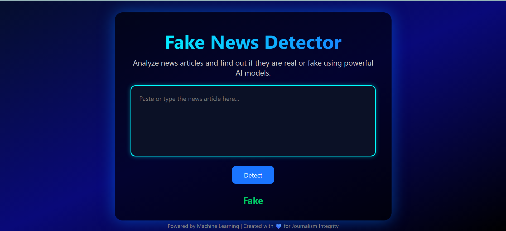

# 📰 Fake News Detection using spaCy Embeddings & ML



## 🧠 Overview

This project detects whether a news article is **Real** or **Fake** using Natural Language Processing (NLP) and machine learning. We used **spaCy’s GloVe embeddings** (`en_core_web_lg`) to convert articles into dense vector representations and then trained traditional classifiers (like **Naive Bayes** and **KNN**) for classification.

---

## 📁 Dataset

- **Source**: [Fake and Real News Dataset](https://www.kaggle.com/datasets/clmentbisaillon/fake-and-real-news-dataset)
- **Details**:
  - Contains 2 classes: `FAKE` and `REAL`
  - Fields: `title`, `text`, `subject`, `date`
  - Used only the **`text`** field for training

---

## 🚀 Project Pipeline

### 🔹 1. Data Loading & Cleaning
- Loaded dataset using `pandas`
- Removed missing values and unnecessary fields
- Converted labels (`FAKE` → 0, `REAL` → 1)

### 🔹 2. Text Vectorization
- Used **spaCy**’s `en_core_web_lg` (300-dimensional GloVe)
- For each article: averaged token vectors excluding stopwords/punctuation

### 🔹 3. Train/Test Split
- Used `sklearn`’s `train_test_split` with 80/20 ratio

### 🔹 4. Modeling
- **Multinomial Naive Bayes**
  - Used `MinMaxScaler` to convert embeddings into positive-only space
  - Achieved ~94% accuracy
- **K-Nearest Neighbors (KNN)**
  - Used `euclidean` distance on raw 300D embeddings
  - Achieved ~99% accuracy 🎯

### 🔹 5. Evaluation
- Classification report (Precision, Recall, F1)
- Confusion Matrix (see below 👇)

<p align="center">
  
</p>

---

## 🔍 Key Insights

| Model          | Accuracy | Notes |
|----------------|----------|-------|
| MultinomialNB  | 94%      | Needed scaling to handle negative embeddings |
| KNN (k=5)      | **99%**  | GloVe vectors work beautifully with Euclidean distance |

- Embeddings (300D) reduce noise & improve performance compared to TF-IDF/BOW
- KNN benefited from dense, contextual GloVe vectors

---

## 🧪 Live Prediction App (Flask)

### 🛠 Features:
- Web form input
- Real-time prediction using trained model
- Returns `FAKE` or `REAL` immediately

### 🖥️ How It Works
- User inputs news article text
- Text is processed → vectorized via spaCy → classified using trained KNN model
- Result is displayed on the webpage

---

## 🧰 Tech Stack

- **NLP**: `spaCy`, `en_core_web_lg`
- **ML**: `scikit-learn`
- **Web App**: `Flask`
- **Deployment-ready**: Yes ✅
- **Data Viz**: `seaborn`, `matplotlib`

---

## 📂 Project Structure

```
├── app.py                     # Flask application
├── artifacts/
│   ├── model.pkl              # Trained model (KNN)
│   ├── confusion_matrix.png   # Evaluation plot
│   └── screenshot.png         # Project UI screenshot
├── templates/
│   └── index.html             # HTML frontend
├── static/                    # (Optional) CSS or JS files
├── README.md                  # Project documentation
├── requirements.txt           # Python dependencies
└── utils/
    └── preprocess.py          # Vectorization or helper functions
```

---

## ▶️ Run Locally

### 1. Clone the repository
```bash
git clone https://github.com/your-username/fake-news-detector.git
cd fake-news-detector
```

### 2. Create virtual environment
```bash
python -m venv venv
source venv/bin/activate  # For Linux/Mac
venv\Scripts\activate     # For Windows
```

### 3. Install dependencies
```bash
pip install -r requirements.txt
python -m spacy download en_core_web_lg
```

### 4. Run the Flask app
```bash
python app.py
```

### 5. Open in browser
Visit: `http://127.0.0.1:5000/`

---

## 🌐 Deployment (Optional)

You can deploy this on:
- **Render**: Free and simple
- **Hugging Face Spaces**: Great for ML demos
- **Railway / Vercel / Heroku**

Let me know if you need a deployment tutorial!

---

## 📈 Future Improvements

- 🔄 Use **BERT** or **MiniLM** embeddings from `sentence-transformers`
- 🌐 Add **API endpoint** for JSON-based prediction
- 🛡️ Improve text preprocessing & language detection
- 💬 Add confidence scores with prediction
- 📊 Use t-SNE or PCA to visualize real vs fake clusters

---

## 🤝 Contributing

Pull requests are welcome! Feel free to fork the repo and propose improvements or fixes.

---

## 📜 License

[MIT License](LICENSE)

---

## 🙋‍♂️ Author

Made with ❤️ by **Jubair** (a.k.a. `silend walker`)  
Data Science & ML Enthusiast | Discipline | Code | Fitness  
Connect: [Your LinkedIn] | [Your GitHub] | [Your Blog (if any)]

