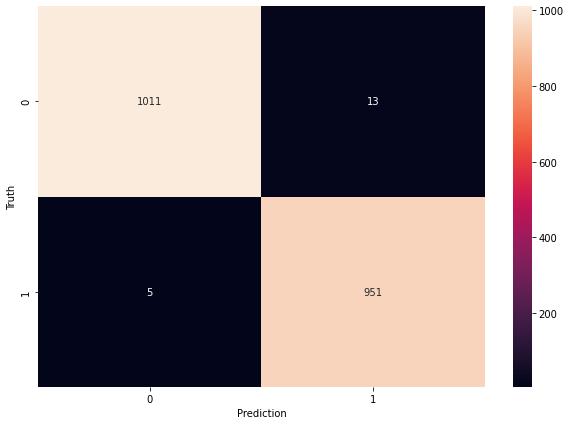

# 📰 Fake News Detection using spaCy Embeddings & ML

## 📝 Overview

This project detects whether a news article is **Real** or **Fake** using Natural Language Processing (NLP) and machine learning. We used **spaCy’s GloVe embeddings** (`en_core_web_lg`) to convert articles into dense vector representations and then trained traditional classifiers (like **Naive Bayes** and **KNN**) for classification.

---

## 📁 Dataset

- **Source**: [Fake and Real News Dataset](https://www.kaggle.com/datasets/clmentbisaillon/fake-and-real-news-dataset)
- **Details**:
  - Contains 2 classes: `Fake` and `Real`
  - Fake Data: 5000, Real Data: 4900
  - Fields:  `Text`, `label`
  - Used only the **`Text`** field for training

---

## 🔁 Project Pipeline

### 🔹 1. Data Loading & Cleaning
- Loaded dataset using `pandas`
- Removed missing values and unnecessary fields
- Converted labels (`Fake` → 0, `Real` → 1)

### 🔹 2. Text Vectorization
- Used **spaCy**’s `en_core_web_lg` (300-dimensional GloVe)
- For each article: averaged token vectors excluding stopwords/punctuation

### 🔹 3. Train/Test Split
- Used `sklearn`’s `train_test_split` with 80/20 ratio

### 🔹 4. Modeling
- **Multinomial Naive Bayes**
  - Used `MinMaxScaler` to convert embeddings into positive-only space
  - Achieved ~94% accuracy
- **K-Nearest Neighbors (KNN)**
  - Used `euclidean` distance on raw 300D embeddings
  - Achieved ~99% accuracy 

### 🔹 5. Evaluation
- Classification report (Precision, Recall, F1)
- Confusion Matrix (see below 👇)

  

---

## 💬 Key Insights

| Model          | Accuracy | Notes |
|----------------|----------|-------|
| MultinomialNB  | 94%      | Needed scaling to handle negative embeddings |
| KNN (k=5)      | **99%**  | GloVe vectors work beautifully with Euclidean distance |

- Embeddings (300D) reduce noise & improve performance compared to TF-IDF/BOW
- KNN benefited from dense, contextual GloVe vectors

---

## 📡 Live Prediction App (Flask)

### 🛠 Features:
- Web form input
- Real-time prediction using trained model
- Returns `Fake` or `Real` immediately

### ⚙️ How It Works
- User inputs news article text
- Text is processed → vectorized via spaCy → classified using trained KNN model
- Result is displayed on the webpage

---

## 	📦 Tech Stack

- **NLP**: `spaCy`, `en_core_web_lg`
- **ML**: `scikit-learn`
- **Web App**: `Flask`
- **Deployment-ready**: Yes ✅
- **Data Viz**: `seaborn`, `matplotlib`

---

## 🏁 Conclusion

This project demonstrates how powerful word embeddings like GloVe can be when combined with traditional machine learning models. By leveraging spaCy’s `en_core_web_lg` vectors, we achieved high accuracy in classifying fake and real news articles. The integration of a Flask-based web interface makes the solution interactive and ready for real-world testing. 

This project not only strengthens understanding of NLP pipelines but also showcases how classical ML techniques can still be highly effective when paired with meaningful feature representations.

